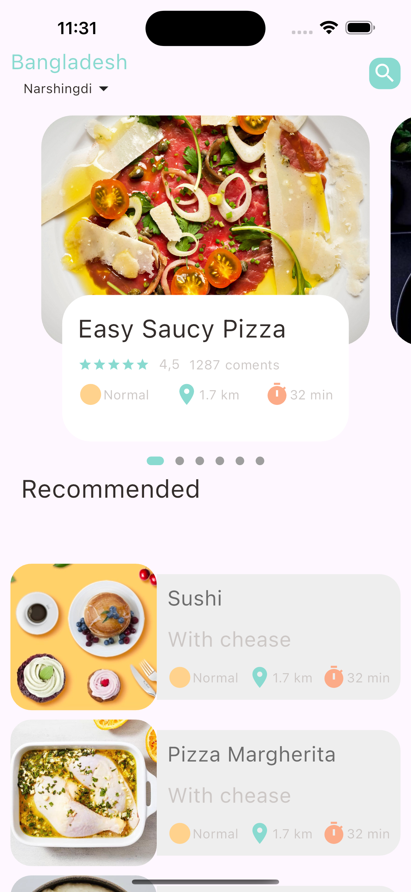
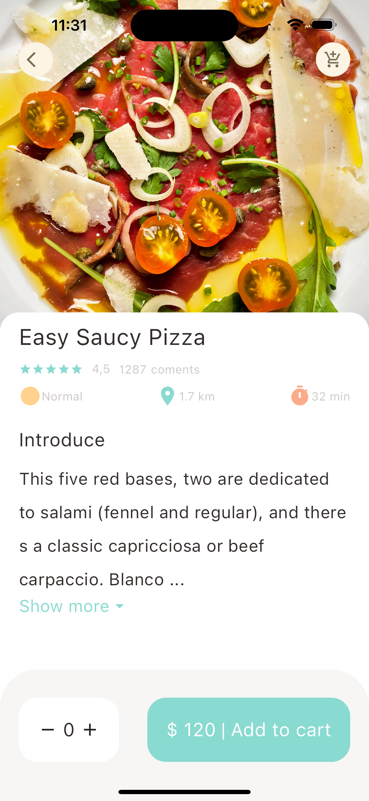
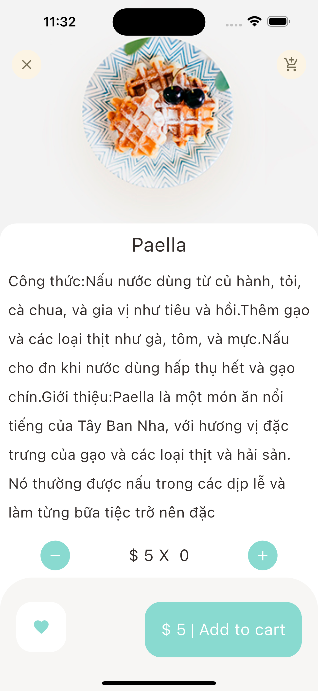

# Food Delivery App - Version 1.0

Welcome to the **Food Delivery App**! 🍔🍕 This is the first version of the app, designed to bring your favorite food to your doorstep. Discover popular and recommended foods, view detailed information about each dish, customize your order, and add it to your cart. Future updates will include Google Map integration for delivery tracking and enhanced cart management.

---

## Features

- **Main Page:**
    - Displays two main sections: *Popular Foods* and *Recommended Foods*.
    - Easy navigation to food details with an option to add to the cart.

- **Food Detail Page:**
    - View detailed information about the food.
    - Select the quantity of food you wish to order.
    - Add the food item to the cart.

---

## Upcoming Features

- **Google Map Integration:**
    - Real-time delivery tracking for your food orders.

- **Cart Management:**
    - Add and remove items from the cart for a personalized shopping experience.

---

## Screenshots

Below are some screenshots of the current version of the app:

<table style="border-spacing: 20px; padding: 10px;">
  <tr>
    <td style="text-align: center;">
      
      <p>Main Page</p>
    </td>
    <td style="text-align: center;">
      
      <p>Popular Food Detail Page</p>
    </td>
    <td style="text-align: center;">
      
      <p>Recommended Food Detail Page</p>
    </td>
  </tr>
</table>


---

## Installation

To get the app running on your local machine, follow these steps:

1. Clone the repository:
    ```bash
    git clone https://github.com/yourusername/food-delivery-app.git
    ```

2. Navigate to the project directory:
    ```bash
    cd food-delivery-app
    ```

3. Install dependencies:
    ```bash
    flutter pub get
    ```

4. Run the app on an emulator or a physical device:
    ```bash
    flutter run
    ```

---

## Future Enhancements

- **Google Maps Integration:**
    - Plan to integrate Google Maps to track the delivery in real-time.

- **Cart Management Features:**
    - Ability to remove items from the cart.
    - A total price calculation with quantity and discount options.

- **User Authentication:**
    - Plan to add user login/signup functionality for personalized experiences.

---

## Contributing

We welcome contributions to make this app even better! If you have any suggestions or improvements, feel free to create a pull request or open an issue.

---

## License

This project is open-source and available under the [MIT License](LICENSE).

---

## Contact

For any inquiries, feel free to contact me at [your.email@example.com].

---

## Acknowledgements

- **Flutter** – for making mobile development easy and fun!
- **Dart** – for the beautiful and powerful language.
- **Google** – for providing great APIs and services.

---

### End of README
